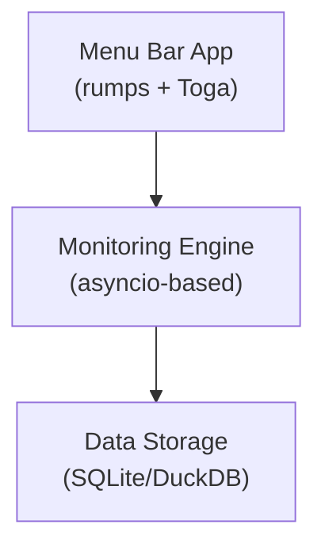

# Network Stats - Product Specification

## Overview

Network Stats is a cross-platform network monitoring application designed to provide continuous monitoring of network connectivity with both CLI and GUI interfaces. The application tracks network uptime, latency metrics, and provides visualization tools for analyzing network performance over time.

## Vision

Create a professional-grade network monitoring tool that:
- Provides real-time network connectivity monitoring
- Offers both CLI and GUI interfaces for different use cases
- Maintains historical data for trend analysis
- Delivers actionable insights through intuitive visualizations
- Runs efficiently in the background with minimal resource usage

## Core Features

### 1. Network Monitoring Engine
- Continuous monitoring of multiple network targets
- Configurable monitoring intervals
- Support for both ICMP ping and native Python implementation
- Comprehensive logging and error handling

[📖 Detailed Network Monitoring Specification](./network-monitoring/index.md)

**Files:**
- [current-implementation.md](./network-monitoring/current-implementation.md)
- [error-handling.md](./network-monitoring/error-handling.md)
- [future-enhancements.md](./network-monitoring/future-enhancements.md)
- [future-implementation-native-python-ping.md](./network-monitoring/future-implementation-native-python-ping.md)
- [index.md](./network-monitoring/index.md)
- [logging-architecture.md](./network-monitoring/logging-architecture.md)
- [monitoring-engine-architecture.md](./network-monitoring/monitoring-engine-architecture.md)
- [performance-optimization.md](./network-monitoring/performance-optimization.md)
- [testing-strategy.md](./network-monitoring/testing-strategy.md)

### 2. Data Storage & Analytics
- Efficient time-series data storage with SQLite
- Planned migration path to DuckDB for enhanced performance
- Data retention policies and archival strategies
- Query optimization for real-time analytics

[📖 Detailed Database Specification](./database/index.md)

**Files:**
- [current-implementation-sqlite.md](./database/current-implementation-sqlite.md)
- [data-retention-and-archival.md](./database/data-retention-and-archival.md)
- [future-enhancements.md](./database/future-enhancements.md)
- [future-implementation-duckdb.md](./database/future-implementation-duckdb.md)
- [index.md](./database/index.md)
- [performance-benchmarks.md](./database/performance-benchmarks.md)
- [query-optimization.md](./database/query-optimization.md)
- [testing-strategy.md](./database/testing-strategy.md)

### 3. macOS Menu Bar Application
- Native macOS menu bar integration
- Real-time status indicators
- Quick access to statistics and settings
- Background monitoring with minimal UI footprint

[📖 Detailed Menu Bar Specification](./menubar/index.md)

**Files:**
- [accessibility.md](./menubar/accessibility.md)
- [current-implementation.md](./menubar/current-implementation.md)
- [design-principles.md](./menubar/design-principles.md)
- [future-enhancements.md](./menubar/future-enhancements.md)
- [future-implementation.md](./menubar/future-implementation.md)
- [index.md](./menubar/index.md)
- [integration-points.md](./menubar/integration-points.md)
- [performance-optimization.md](./menubar/performance-optimization.md)
- [testing-strategy.md](./menubar/testing-strategy.md)

### 4. Settings & Configuration GUI
- User-friendly settings interface
- Target management (add/remove/edit monitoring targets)
- Monitoring interval configuration
- Alert threshold settings
- Data retention preferences

[📖 Detailed Settings GUI Specification](./settings-gui/index.md)

**Files:**
- [architecture.md](./settings-gui/architecture.md)
- [configuration-persistence.md](./settings-gui/configuration-persistence.md)
- [design-principles.md](./settings-gui/design-principles.md)
- [future-enhancements.md](./settings-gui/future-enhancements.md)
- [index.md](./settings-gui/index.md)
- [tab-specifications.md](./settings-gui/tab-specifications.md)
- [testing.md](./settings-gui/testing.md)
- [validation-and-error-handling.md](./settings-gui/validation-and-error-handling.md)

### 5. Statistics & Visualization
- Real-time and historical uptime statistics
- Interactive charts and graphs
- Customizable time ranges (hour, day, week, month)
- Export capabilities for reports

[📖 Detailed Statistics & Visualization Specification](./statistics-visualization/index.md)

**Files:**
- [current-implementation.md](./statistics-visualization/current-implementation.md)
- [design-principles.md](./statistics-visualization/design-principles.md)
- [future-enhancements.md](./statistics-visualization/future-enhancements.md)
- [future-implementation.md](./statistics-visualization/future-implementation.md)
- [index.md](./statistics-visualization/index.md)
- [performance-optimization.md](./statistics-visualization/performance-optimization.md)

### 6. Packaging & Deployment
- Native macOS application bundle (.app)
- Universal binary support (Intel & Apple Silicon)
- DMG installer with code signing
- Automated release pipeline via GitHub Actions
- Future support for Windows and Linux

[📖 Detailed Packaging & Deployment Specification](./packaging-deployment/index.md)

**Files:**
- [auto-update-system.md](./packaging-deployment/auto-update-system.md)
- [current-implementation.md](./packaging-deployment/current-implementation.md)
- [dmg-creation.md](./packaging-deployment/dmg-creation.md)
- [future-enhancements.md](./packaging-deployment/future-enhancements.md)
- [github-actions-automation.md](./packaging-deployment/github-actions-automation.md)
- [index.md](./packaging-deployment/index.md)
- [installation-methods.md](./packaging-deployment/installation-methods.md)
- [macos-application-bundle.md](./packaging-deployment/macos-application-bundle.md)
- [security-considerations.md](./packaging-deployment/security-considerations.md)
- [testing-deployment.md](./packaging-deployment/testing-deployment.md)
- [universal-binary-support.md](./packaging-deployment/universal-binary-support.md)
- [version-management.md](./packaging-deployment/version-management.md)

## Architecture Overview

## Technology Stack

- **Language**: Python 3.11+
- **GUI Framework**: Toga (cross-platform) + rumps (macOS menu bar)
- **Database**: SQLite (current) → DuckDB (future)
- **Data Analysis**: Polars
- **Visualization**: Plotly (current) → Altair/Vega-Lite (future)
- **Packaging**: PyInstaller
- **Dependency Management**: Poetry

## Development Principles

1. **Modular Architecture**: Clear separation of concerns between monitoring, storage, and UI components
2. **Async-First**: Leverage Python's asyncio for efficient concurrent operations
3. **User Privacy**: All data stored locally, no external telemetry
4. **Performance**: Minimal resource usage, efficient data structures
5. **Extensibility**: Plugin architecture for future enhancements

## Future Roadmap

### Phase 1: Core Stability (Current)
- ✅ Basic monitoring functionality
- ✅ SQLite storage
- ✅ Simple menu bar app
- ✅ Basic statistics view

### Phase 2: Enhanced Features (Q1 2025)
- 🔲 Native Python ping implementation
- 🔲 Settings GUI
- 🔲 Alert system
- 🔲 Enhanced visualizations

### Phase 3: Performance & Scale (Q2 2025)
- 🔲 DuckDB migration
- 🔲 Advanced analytics
- 🔲 Multi-target performance optimization
- 🔲 Cloud sync options

### Phase 4: Cross-Platform (Q3 2025)
- 🔲 Windows support
- 🔲 Linux support
- 🔲 Mobile companion apps
- 🔲 API for third-party integrations

## Success Metrics

- **Performance**: < 1% CPU usage during normal operation
- **Memory**: < 50MB RAM footprint
- **Reliability**: 99.9% uptime for the monitoring service
- **User Experience**: < 3 clicks to any feature
- **Data Accuracy**: Zero data loss, accurate millisecond precision

## Getting Started

See the [README](../../README.md) for installation and development setup instructions.

## Contributing

This specification serves as the source of truth for feature development. All new features should be documented here before implementation. 